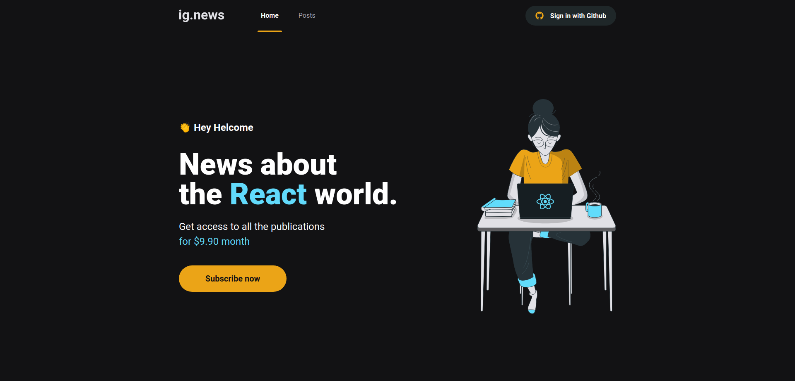
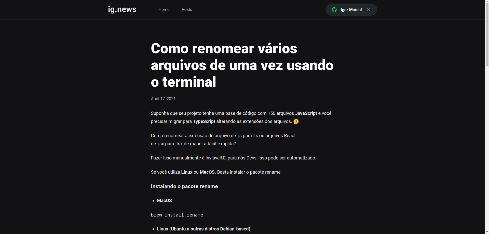

  

<h4 align="center">
  Seu Blog tec   
</h4>

<h4 align="center">
  Your tec blog
</h4>

  <a href="#rocket-technologies">Technologies</a>

<h4 align="center">
  Demo (unsign)
</h4>

  

  

<h4 align="center">
  Demo (sign)
</h4>

  

  

## :rocket: Technologies

This project was developed with the following technologies:

- [Next.js](https://nextjs.org/)
- [FaunaDb](https://fauna.com/)
- [Stripe](https://stripe.com/en-br)
- [Prismic](https://prismic.io/)
- [SASS](https://sass-lang.com/)

Made with ❤ [Igor Marchi](https://www.linkedin.com/in/igor-marchi/) :laughing:
